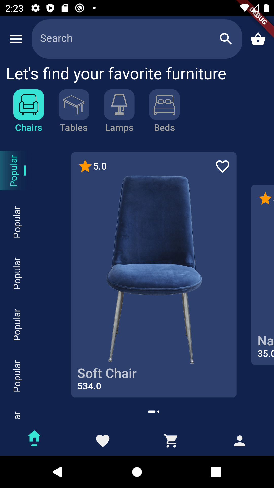
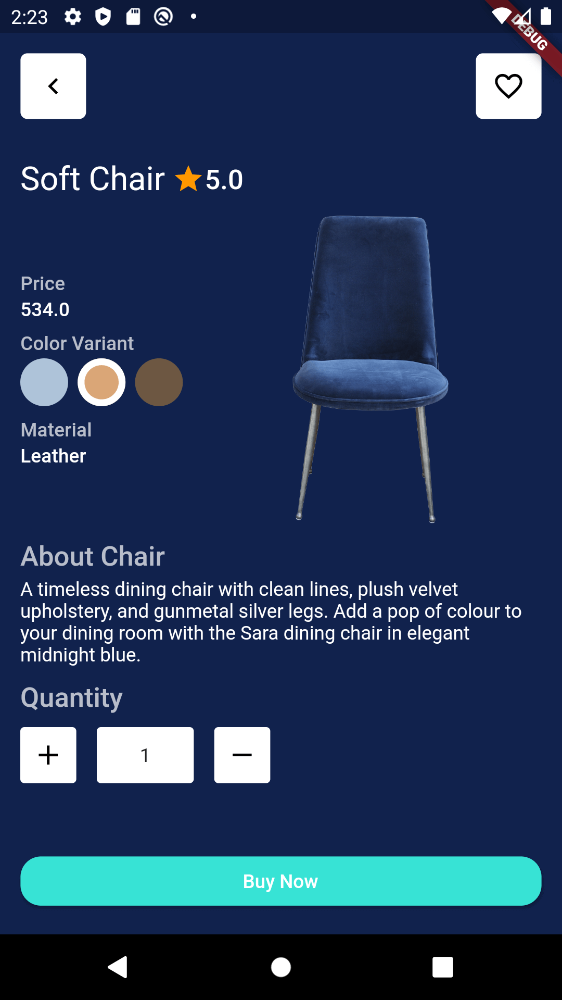
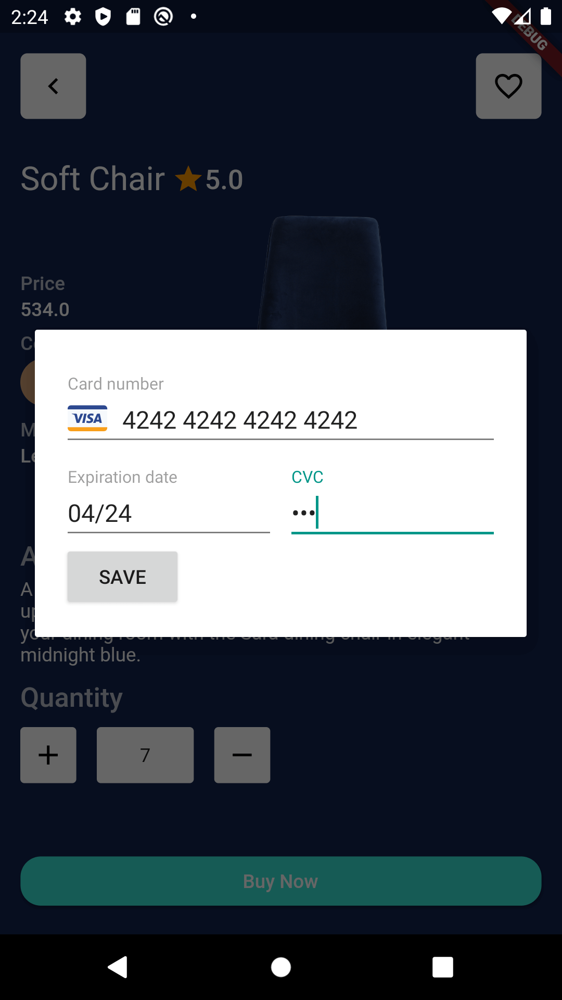
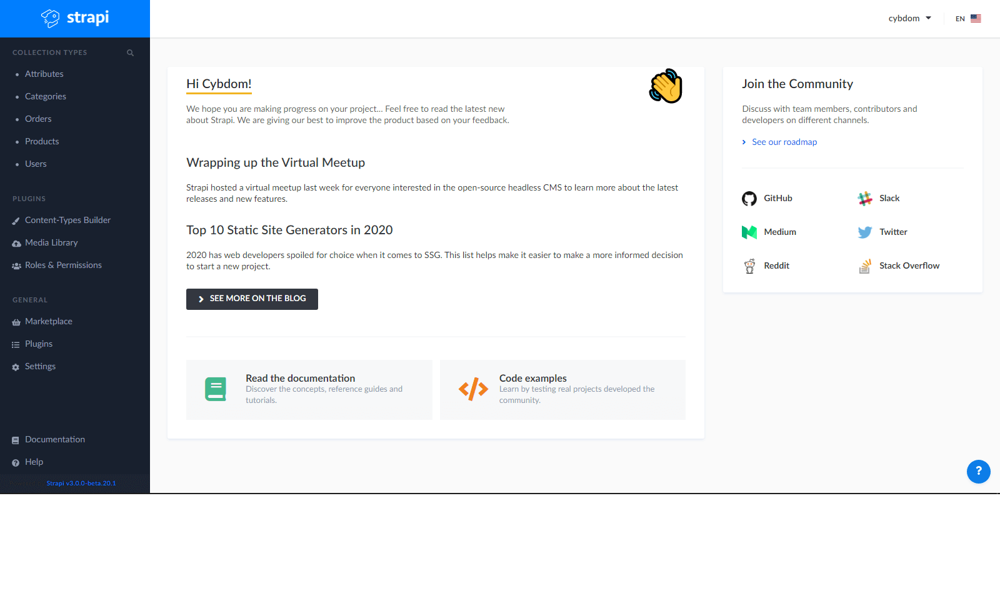
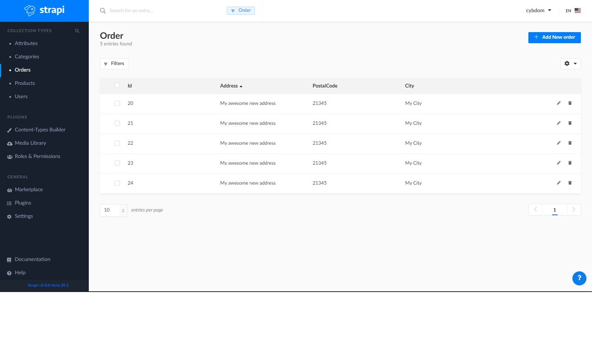
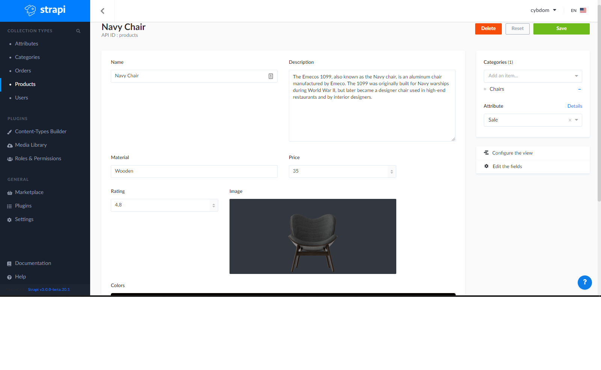

This project is a simple ecommerce app/server.

The frontend is built in flutter.

The backend is using Strapi (NodeJs).

Authentication is based on JWT and is handled by Strapi

Payment processing is handled by Stripe.

For this project to work you need to get your API keys from <a href="https://dashboard.stripe.com/">Stripe</a>
and set them in 
    
    app\lib\ui\screens\details.dart
    server\api\order\controllers\order.js

Follow me on <a href="https://www.youtube.com/channel/UC2SO2MNjtM9E09EqrUj-LcQ">Youtube</a> for the Tutorial series.

If you find this content helpfull, then please <a href=" https://www.buymeacoffee.com/bi3cp0Zk5">Support Me!</a>

